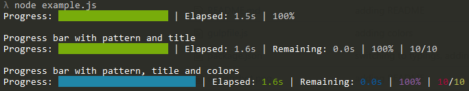

# ts-progress

> Flexible node progress bar


 
## Installation
```bash
 npm install ts-progress
 ```
 
## Quickstart
 
 ```javascript
var Progress = require('ts-progress');

var items = 50;
var progress = new Progress(items);
progress.start();
var count = 0;
var iv = setInterval(function () {
    count++;
    progress.update();
    if (count == items) {
        clearInterval(iv);
    }
}, 150);
 ```
## options